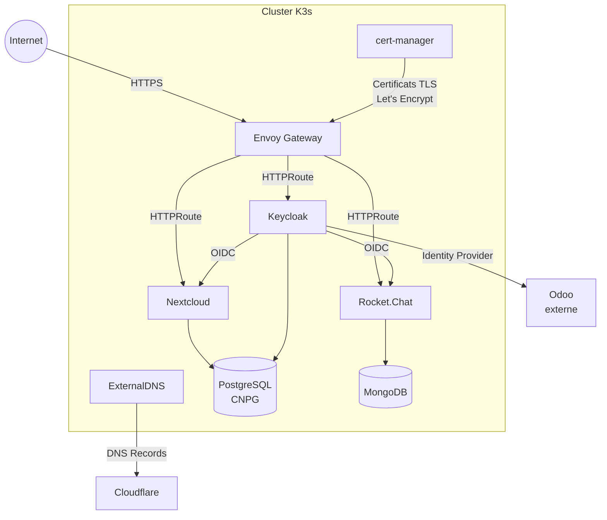

# Superquinquin-sur-Deule GitOps

Infrastructure GitOps pour un cluster Kubernetes k3s haute disponibilité hébergé sur Hetzner Cloud, géré par Flux.

## Architecture

```
                    ┌─────────────────────────────────────┐
                    │         Hetzner Cloud (fsn1)         │
                    │                                     │
                    │  ┌───────────┐  ┌───────────┐  ┌───────────┐
Internet ──────────►│  │  master-0  │  │  master-1  │  │  master-2  │
                    │  │ (init)     │  │ (join)     │  │ (join)     │
                    │  │ 10.0.1.10  │  │ 10.0.1.11  │  │ 10.0.1.12  │
                    │  └─────┬──────┘  └─────┬──────┘  └─────┬──────┘
                    │        │    Réseau privé (10.0.1.0/24)  │
                    │        └───────────┴───────────────┘    │
                    └─────────────────────────────────────────┘
```

### Stack applicative



- **3 nœuds** master/worker k3s avec embedded etcd
- **CNI** : Cilium
- **Gateway** : Envoy Gateway (Gateway API)
- **Certificats** : cert-manager + Let's Encrypt (DNS-01 via Cloudflare)
- **Base de données** : PostgreSQL 17 (CrunchyData PGO) avec backups S3
- **GitOps** : Flux v2 (operator pattern)
- **Secrets** : SOPS + age

## Prérequis

Outils nécessaires (gérés via [mise](https://mise.jdx.dev)) :

- `terraform`
- `kubectl`
- `helmfile`
- `flux` CLI
- `sops`
- `age`
- `just`
- `gum`
- `yq`

```bash
mise install
```

## Déploiement from scratch

### 1. Configurer les secrets

Créer le fichier `terraform/terraform.tfvars` :

```hcl
hcloud_token   = "<token API Hetzner>"
ssh_public_key = "<contenu de ~/.ssh/id_ed25519.pub>"
s3_access_key  = "<clé d'accès S3 Hetzner>"
s3_secret_key  = "<clé secrète S3 Hetzner>"
domain         = "example.com"
```

### 2. Provisionner l'infrastructure

```bash
cd terraform
terraform init
terraform plan
terraform apply
```

Cela crée :
- 3 serveurs Hetzner (cx22) avec k3s en mode HA
- Un réseau privé pour la communication inter-nœuds
- Un bucket S3 pour les backups PostgreSQL
- Les règles firewall (SSH, HTTP/S, Kubernetes API, Cilium, etcd, kubelet)

### 3. Récupérer le kubeconfig

Attendre quelques minutes que k3s soit initialisé sur le premier nœud, puis :

```bash
cd ..
scp root@$(terraform -chdir=terraform output -raw master_ips | head -1):/etc/rancher/k3s/k3s.yaml ./kubeconfig
```

Remplacer l'adresse du serveur dans le kubeconfig par l'IP publique du premier nœud :

```bash
SERVER_IP=$(terraform -chdir=terraform output -json master_ips | yq '.[0]')
sed -i "s|127.0.0.1|$SERVER_IP|g" kubeconfig
```

Vérifier que le cluster est fonctionnel :

```bash
kubectl get nodes
```

Les 3 nœuds doivent apparaître (ils peuvent être `NotReady` tant que Cilium n'est pas déployé).

### 4. Configurer SOPS

Générer une clé age (ou utiliser une existante) :

```bash
age-keygen -o age.key
```

Mettre à jour la clé publique dans `.sops.yaml` si nécessaire, puis créer le secret Kubernetes pour Flux :

```bash
kubectl create namespace flux-system
kubectl create secret generic sops-age-secret \
  --namespace flux-system \
  --from-file=age.agekey=age.key
```

### 5. Bootstrap Flux

Appliquer les CRDs nécessaires :

```bash
just bootstrap crds
```

Déployer cert-manager, le Flux operator et l'instance Flux :

```bash
just bootstrap apps
```

### 6. Vérifier le déploiement

Flux va maintenant réconcilier automatiquement toutes les ressources depuis le repo Git. Suivre la progression :

```bash
kubectl get ks -A -w
```

L'ordre de déploiement géré par les dépendances Flux :

1. **Cilium** (CNI) — les nœuds passent en `Ready`
2. **cert-manager** → **certificates** (ClusterIssuer + wildcard TLS)
3. **Envoy Gateway** (dépend de Cilium + certificates)
4. **PGO operator** → **PGO cluster** (PostgreSQL)
5. **Mattermost** / **Nextcloud** (dépendent de PGO cluster + Envoy Gateway)

## Structure du repo

```
├── terraform/              # Infrastructure Hetzner (VMs, réseau, firewall, S3)
├── bootstrap/              # Bootstrap initial (CRDs + Flux via helmfile)
├── kubernetes/
│   ├── flux/cluster/       # Kustomization racine Flux
│   ├── apps/               # Applications déployées par Flux
│   │   ├── cert-manager/   # Gestion des certificats
│   │   ├── database/       # PostgreSQL (operator + cluster)
│   │   ├── flux-system/    # Flux operator + instance
│   │   ├── network/        # Cilium, Envoy Gateway, certificats TLS
│   │   └── tools/          # Mattermost, Nextcloud
│   └── components/         # Composants Kustomize partagés
└── .just/                  # Commandes Just (bootstrap, kubernetes)
```

## Commandes utiles

```bash
# Forcer la réconciliation
just kube sync-git          # GitRepository
just kube sync-ks           # Kustomizations
just kube sync-hr           # HelmReleases
just kube sync-oci          # OCIRepositories

# Debug
just kube view-secret <ns> <secret>   # Décrypter un secret
just kube node-shell <node>            # Shell sur un nœud
just kube prune-pods                   # Nettoyer les pods Failed/Pending

# Appliquer un changement local sans commit
just kube apply-ks <ns> <ks>
```

## Gestion des secrets chiffrés

Les secrets sont chiffrés avec SOPS + age. Les fichiers `*.sops.yaml` dans `kubernetes/` sont automatiquement déchiffrés par Flux.

Pour chiffrer un nouveau secret :

```bash
sops --encrypt --in-place kubernetes/apps/<path>/secret.sops.yaml
```

Pour éditer un secret existant :

```bash
sops kubernetes/apps/<path>/secret.sops.yaml
```
